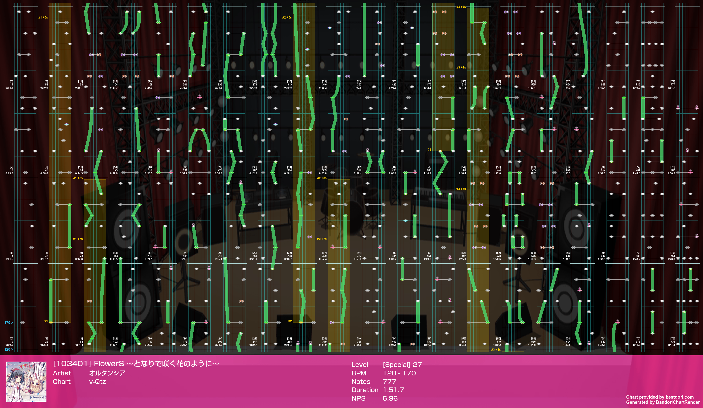

# <p align="center">BandoriChartRender
<p align="center">Another chart previewing library for Bandori.

## Requirements

Python 3.9+, and:

 - pydantic~=1.10.4
 - Pillow~=9.4.0
 - httpx~=0.23.3

```bash
pip install -r requirements.txt
```

## Usage

### Render official chart

`song_id` is the id of the song in the game, you can find it on [bestdori.com](https://bestdori.com/).

| difficulty  | IntEnum |
|:-----------:|:-------:|
|    Easy     |   `0`   |
|   Normal    |   `1`   |
|    Hard     |   `2`   |
|   Expert    |   `3`   |
|   Special   |   `4`   |


```python
from BandoriChartRender import render_chart_official

im = await render_chart_official(song_id=487, difficulty=4)  # [超高難易度 新SPECIAL] 六兆年と一夜物語

im.show()  # show the image directly
im.save('487_4.png')  # save the image
io = im.to_bytes_io()  # get the image as a BytesIO object
```


### Render community chart (fan-made chart on [bestdori.com](https://bestdori.com/))

```python
from BandoriChartRender import render_chart_user_post

im = await render_chart_user_post(post_id=103401)  # FlowerS ～となりで咲く花のように～

im.show()  # show the image directly
im.save('103401.png')  # save the image
io = im.to_bytes_io()  # get the image as a BytesIO object
```



## Related

 - [Arcaea-Infinity/ArcaeaChartRender](https://github.com/Arcaea-Infinity/ArcaeaChartRender)
 - [zhanbao2000/unity_sprites_cut](https://github.com/zhanbao2000/unity_sprites_cut)

## Special Thanks

 - [you1b231](https://home.gamer.com.tw/you1b231)
 - [bestdori.com](https://bestdori.com/)
